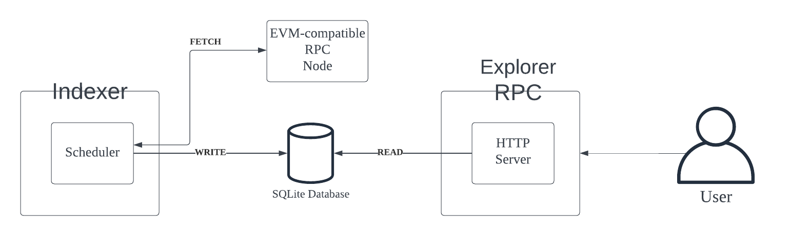

# Overview
SimpleEthIndexer indexes indexes and stores the block, transaction, and event from an EVM-compatible chain. SimpleEthExplorer fetches the data from the indexed database for useful query to serve the users.

## Indexer
On start, SimpleEthIndexer indexes and stores the last 50 blocks of EVM-compatible chain onto the sqlite sql database. Periodically every 10 seconds, it fetches the last 2 blocks of EVM-compatible chain

## Server

It also has an HTTP server that can handle the following logic.

- Query all events related to a particular address (`GetAllEventsByAddress`)

The [rpc/simple_eth_explorer.proto](rpc/simple_eth_explorer.proto) file defines the RPC, and it is translated into different http methods, requests, and responses by [Twirp](https://twitchtv.github.io/twirp/docs/intro.html).

## Architecture

## Demo
https://github.com/seungjulee/simple-eth-indexer/assets/4685781/668d5f36-770a-4783-a0b2-61cd516746c8

## Prerequisite
1. sqlite
2. [Twirp](https://twitchtv.github.io/twirp/docs/intro.html) Twirp is a simple RPC framework built on protobuf. You define a service in a .proto specification file, then Twirp will generate servers and clients for that service.
3. protobuf - For installation instructions, see Protocol [Buffer Compiler Installation](https://grpc.io/docs/protoc-installation/) (For example in MacOS: `brew install protobuf`).

## Running it locally

1. Run indexer by `make run_indexer`
2. Run http server by `make run_server`
3. Send a http request like specified on `make run_example_get_all_events_by_address`

## Development

## Indexer
- When creating a new table, update the automigration on [pkg/datastore/sqlite.go](.pkg/datastore/sqlite.go:29)
- To add a new method, update [pkg/datastore/datastore.go](.pkg/datastore/datastore.go) interface first

## RPC / API Server
When adding a new method, do the following
1. Update [rpc/simple_eth_explorer.proto](rpc/simple_eth_explorer.proto)
2. Run `make gen`. This creates a http compliant rpc interface.
3. On [internal/server/server.go](./internal/server/server.go), implement the new method as specified on the `SimpleOsmosisExplorer` interface at [rpc/simple_eth_explorer.twirp.go](./rpc/simple_eth_explorer.twirp.go).

For more Info, please visit https://twitchtv.github.io/twirp/

## TODO
### Infra
1. Use Websocket to subscribe to new blocks and transactions
2. If any block height is missing, fetch and index the missing block
3. Add a way to backfill the data

## Example Query
```sh
 curl --request "POST" \
    --header "Content-Type: application/json" \
    --data '{"address": "0x00000000000000ADc04C56Bf30aC9d3c0aAF14dC"}' \
    http://localhost:8080/twirp/rpc.SimpleEthExplorer/GetAllEventsByAddress | jq

{
  "start_block": "17798064",
  "end_block": "17798090",
  "events": [
    {
      "address": "0x00000000000000ADc04C56Bf30aC9d3c0aAF14dC",
      "topics": [
        "0x9d9af8e38d66c62e2c12f0225249fd9d721c54b83f48d9352c97c6cacdcb6f31",
        "0x00000000000000000000000089f4dabe58705b9375f857392747c761af67c482",
        "0x000000000000000000000000004c00500000ad104d7dbd00e3ae0a5c00560c00"
      ],
      "data": "",
      "block_number": "17798064",
      "tx_hash": "0x391d50ed6aa535ef666eb14fe9543d30310f66fa90f732b147737139ea8a99c9",
      "tx_index": "87",
      "block_hash": "0x3004289e289bf97cb45a0efc0f6935d05361f61190f859c608bc49f09a6a2f33",
      "index": "253",
      "removed": false
    },
    {
      "address": "0x00000000000000ADc04C56Bf30aC9d3c0aAF14dC",
      "topics": [
        "0x9d9af8e38d66c62e2c12f0225249fd9d721c54b83f48d9352c97c6cacdcb6f31",
        "0x00000000000000000000000089f4dabe58705b9375f857392747c761af67c482",
        "0x000000000000000000000000004c00500000ad104d7dbd00e3ae0a5c00560c00"
      ],
      "data": "",
      "block_number": "17798064",
      "tx_hash": "0x391d50ed6aa535ef666eb14fe9543d30310f66fa90f732b147737139ea8a99c9",
      "tx_index": "87",
      "block_hash": "0x3004289e289bf97cb45a0efc0f6935d05361f61190f859c608bc49f09a6a2f33",
      "index": "254",
      "removed": false
    },
    {
      "address": "0x00000000000000ADc04C56Bf30aC9d3c0aAF14dC",
      "topics": [
        "0x6bacc01dbe442496068f7d234edd811f1a5f833243e0aec824f86ab861f3c90d",
        "0x0000000000000000000000002ff95a692839f8d6aafa55b70f536349f6163fb6",
        "0x000000000000000000000000004c00500000ad104d7dbd00e3ae0a5c00560c00"
      ],
      "data": "",
      "block_number": "17798064",
      "tx_hash": "0x9dcb338a20bffd5cb6dc5f73855555924a847fb131ccdff536d5cfdda2de574e",
      "tx_index": "111",
      "block_hash": "0x3004289e289bf97cb45a0efc0f6935d05361f61190f859c608bc49f09a6a2f33",
      "index": "713",
      "removed": false
    },
    {
      "address": "0x00000000000000ADc04C56Bf30aC9d3c0aAF14dC",
      "topics": [
        "0x9d9af8e38d66c62e2c12f0225249fd9d721c54b83f48d9352c97c6cacdcb6f31",
        "0x0000000000000000000000004d0683f23db4fb826761854cb36019ea991c4a3f",
        "0x000000000000000000000000004c00500000ad104d7dbd00e3ae0a5c00560c00"
      ],
      "data": "",
      "block_number": "17798069",
      "tx_hash": "0x25b7274c9620b939a5bcdf004ee75bb7e774ed5a6a83ce6b3694f09e89de231e",
      "tx_index": "80",
      "block_hash": "0xa0c5eece25951f62e1358368de22dcf50613471b35eba153859a30383ec96a0a",
      "index": "272",
      "removed": false
    },
    {
      "address": "0x00000000000000ADc04C56Bf30aC9d3c0aAF14dC",
      "topics": [
        "0x9d9af8e38d66c62e2c12f0225249fd9d721c54b83f48d9352c97c6cacdcb6f31",
        "0x00000000000000000000000017b5708a1b1ef0c51e64822ca9b3e98e7a4f89ef",
        "0x0000000000000000000000000000000000000000000000000000000000000000"
      ],
      "data": "",
      "block_number": "17798069",
      "tx_hash": "0x893654d82c0fc29aa5afbf9d79878a6895290c3a50a26ba04cc6f0f1149605e6",
      "tx_index": "83",
      "block_hash": "0xa0c5eece25951f62e1358368de22dcf50613471b35eba153859a30383ec96a0a",
      "index": "278",
      "removed": false
    },
    {
      "address": "0x00000000000000ADc04C56Bf30aC9d3c0aAF14dC",
      "topics": [
        "0x9d9af8e38d66c62e2c12f0225249fd9d721c54b83f48d9352c97c6cacdcb6f31",
        "0x00000000000000000000000074f6c6e97ab414428105362a55b22e508d5e36cb",
        "0x000000000000000000000000004c00500000ad104d7dbd00e3ae0a5c00560c00"
      ],
      "data": "",
      "block_number": "17798073",
      "tx_hash": "0xfd4527bb58f44dfb42b3b79906b3f0d478951fe5aa18a4e561cbbaf86349cc5b",
      "tx_index": "57",
      "block_hash": "0x0d723c9baf9f922845b77f63b9a43ba557a5c23e105fee70a8bcfe9334ea57ab",
      "index": "198",
      "removed": false
    },
    {
      "address": "0x00000000000000ADc04C56Bf30aC9d3c0aAF14dC",
      "topics": [
        "0x9d9af8e38d66c62e2c12f0225249fd9d721c54b83f48d9352c97c6cacdcb6f31",
        "0x0000000000000000000000004f835aa9c21c13a31a93a8b3a94027c2f3a21d99",
        "0x000000000000000000000000004c00500000ad104d7dbd00e3ae0a5c00560c00"
      ],
      "data": "",
      "block_number": "17798073",
      "tx_hash": "0xfd4527bb58f44dfb42b3b79906b3f0d478951fe5aa18a4e561cbbaf86349cc5b",
      "tx_index": "57",
      "block_hash": "0x0d723c9baf9f922845b77f63b9a43ba557a5c23e105fee70a8bcfe9334ea57ab",
      "index": "199",
      "removed": false
    },
    {
      "address": "0x00000000000000ADc04C56Bf30aC9d3c0aAF14dC",
      "topics": [
        "0x9d9af8e38d66c62e2c12f0225249fd9d721c54b83f48d9352c97c6cacdcb6f31",
        "0x000000000000000000000000f3bf97159c613c605fa7c349523124aa897e0682",
        "0x000000000000000000000000004c00500000ad104d7dbd00e3ae0a5c00560c00"
      ],
      "data": "",
      "block_number": "17798073",
      "tx_hash": "0xe2e42cc799bd9407f7acf8f65b80289b0142bc9da9f0b7d6a52b9a3259ceb5a1",
      "tx_index": "59",
      "block_hash": "0x0d723c9baf9f922845b77f63b9a43ba557a5c23e105fee70a8bcfe9334ea57ab",
      "index": "212",
      "removed": false
    },
    {
      "address": "0x00000000000000ADc04C56Bf30aC9d3c0aAF14dC",
      "topics": [
        "0x9d9af8e38d66c62e2c12f0225249fd9d721c54b83f48d9352c97c6cacdcb6f31",
        "0x00000000000000000000000066054d63f1fe6d6d419d2f94da7ee72e60d3c467",
        "0x000000000000000000000000004c00500000ad104d7dbd00e3ae0a5c00560c00"
      ],
      "data": "",
      "block_number": "17798074",
      "tx_hash": "0xce84725488e568a5d01285b87f8d5ef60c547b7b407f3211d21700f5d21c5839",
      "tx_index": "78",
      "block_hash": "0xbbfa1bac89f8b1bdf39f8247cc0975019927bbed0dd16e7fcd17f66c90e65b2f",
      "index": "257",
      "removed": false
    },
    {
      "address": "0x00000000000000ADc04C56Bf30aC9d3c0aAF14dC",
      "topics": [
        "0x9d9af8e38d66c62e2c12f0225249fd9d721c54b83f48d9352c97c6cacdcb6f31",
        "0x000000000000000000000000e4932dd7fd5b0572761b20b9a67ae534aff017c4",
        "0x000000000000000000000000004c00500000ad104d7dbd00e3ae0a5c00560c00"
      ],
      "data": "",
      "block_number": "17798081",
      "tx_hash": "0x85eaf7954710bd010b6736e1f11df0a40f2a626956402939dcafc22c7bb461b0",
      "tx_index": "48",
      "block_hash": "0x8d136d25428c7b54d621acbcfa8ebada9a63cd72ca11d3285bf6b0fac794acef",
      "index": "80",
      "removed": false
    },
    {
      "address": "0x00000000000000ADc04C56Bf30aC9d3c0aAF14dC",
      "topics": [
        "0x9d9af8e38d66c62e2c12f0225249fd9d721c54b83f48d9352c97c6cacdcb6f31",
        "0x000000000000000000000000815c1b4dbe51b057bd6942a9e1f4a6cb84d95c34",
        "0x000000000000000000000000004c00500000ad104d7dbd00e3ae0a5c00560c00"
      ],
      "data": "",
      "block_number": "17798081",
      "tx_hash": "0x85eaf7954710bd010b6736e1f11df0a40f2a626956402939dcafc22c7bb461b0",
      "tx_index": "48",
      "block_hash": "0x8d136d25428c7b54d621acbcfa8ebada9a63cd72ca11d3285bf6b0fac794acef",
      "index": "81",
      "removed": false
    },
    {
      "address": "0x00000000000000ADc04C56Bf30aC9d3c0aAF14dC",
      "topics": [
        "0x9d9af8e38d66c62e2c12f0225249fd9d721c54b83f48d9352c97c6cacdcb6f31",
        "0x0000000000000000000000004fe2a2a995924f11badc40d6b8464f4552890312",
        "0x000000000000000000000000004c00500000ad104d7dbd00e3ae0a5c00560c00"
      ],
      "data": "",
      "block_number": "17798081",
      "tx_hash": "0x85eaf7954710bd010b6736e1f11df0a40f2a626956402939dcafc22c7bb461b0",
      "tx_index": "48",
      "block_hash": "0x8d136d25428c7b54d621acbcfa8ebada9a63cd72ca11d3285bf6b0fac794acef",
      "index": "82",
      "removed": false
    },
    {
      "address": "0x00000000000000ADc04C56Bf30aC9d3c0aAF14dC",
      "topics": [
        "0x9d9af8e38d66c62e2c12f0225249fd9d721c54b83f48d9352c97c6cacdcb6f31",
        "0x000000000000000000000000ca28a698b5e86f5c76fdfeae467a3e0d60f3c140",
        "0x000000000000000000000000004c00500000ad104d7dbd00e3ae0a5c00560c00"
      ],
      "data": "",
      "block_number": "17798081",
      "tx_hash": "0x85eaf7954710bd010b6736e1f11df0a40f2a626956402939dcafc22c7bb461b0",
      "tx_index": "48",
      "block_hash": "0x8d136d25428c7b54d621acbcfa8ebada9a63cd72ca11d3285bf6b0fac794acef",
      "index": "83",
      "removed": false
    },
    {
      "address": "0x00000000000000ADc04C56Bf30aC9d3c0aAF14dC",
      "topics": [
        "0x6bacc01dbe442496068f7d234edd811f1a5f833243e0aec824f86ab861f3c90d",
        "0x0000000000000000000000003c24f68ceada3dcf81ab2b5c38ccfe18826b19ce",
        "0x000000000000000000000000004c00500000ad104d7dbd00e3ae0a5c00560c00"
      ],
      "data": "",
      "block_number": "17798081",
      "tx_hash": "0x0778a2886b7f61bccffe74b7ec969f086bb9ed074d6830c1e4da0b844ec9ce38",
      "tx_index": "84",
      "block_hash": "0x8d136d25428c7b54d621acbcfa8ebada9a63cd72ca11d3285bf6b0fac794acef",
      "index": "204",
      "removed": false
    },
    {
      "address": "0x00000000000000ADc04C56Bf30aC9d3c0aAF14dC",
      "topics": [
        "0x9d9af8e38d66c62e2c12f0225249fd9d721c54b83f48d9352c97c6cacdcb6f31",
        "0x000000000000000000000000c83e7d578d32e76a2555c5baffe71a4f50ea3c61",
        "0x000000000000000000000000004c00500000ad104d7dbd00e3ae0a5c00560c00"
      ],
      "data": "",
      "block_number": "17798083",
      "tx_hash": "0xae668d65077553508978c56e7e63849ba28e4ba1b327b017e07c6c6a3c319b15",
      "tx_index": "89",
      "block_hash": "0xe6aa7aa45937cd895636ae72d33cac4ff890cf79935393e9a411fd377e3ee3dd",
      "index": "188",
      "removed": false
    },
    {
      "address": "0x00000000000000ADc04C56Bf30aC9d3c0aAF14dC",
      "topics": [
        "0x9d9af8e38d66c62e2c12f0225249fd9d721c54b83f48d9352c97c6cacdcb6f31",
        "0x000000000000000000000000a30f9ec8d5a67f5c51dbcdf92e7b7fab270f4dac",
        "0x000000000000000000000000004c00500000ad104d7dbd00e3ae0a5c00560c00"
      ],
      "data": "",
      "block_number": "17798084",
      "tx_hash": "0x5057c5e6b449e93f5d4268b8bb2c5206f31adebf85b97e53141138a2c90f1cfc",
      "tx_index": "60",
      "block_hash": "0x1a45605c4beae393cb53fd815d849a3ffb575d6d9360a06e014f2fe5b02f902e",
      "index": "180",
      "removed": false
    },
    {
      "address": "0x00000000000000ADc04C56Bf30aC9d3c0aAF14dC",
      "topics": [
        "0x9d9af8e38d66c62e2c12f0225249fd9d721c54b83f48d9352c97c6cacdcb6f31",
        "0x000000000000000000000000623575908f739c57489a008e27652197f4918586",
        "0x000000000000000000000000004c00500000ad104d7dbd00e3ae0a5c00560c00"
      ],
      "data": "",
      "block_number": "17798084",
      "tx_hash": "0x5057c5e6b449e93f5d4268b8bb2c5206f31adebf85b97e53141138a2c90f1cfc",
      "tx_index": "60",
      "block_hash": "0x1a45605c4beae393cb53fd815d849a3ffb575d6d9360a06e014f2fe5b02f902e",
      "index": "181",
      "removed": false
    },
    {
      "address": "0x00000000000000ADc04C56Bf30aC9d3c0aAF14dC",
      "topics": [
        "0x9d9af8e38d66c62e2c12f0225249fd9d721c54b83f48d9352c97c6cacdcb6f31",
        "0x000000000000000000000000551bb00d7f17e0eaa2d9fcef7703d3ded8c965bb",
        "0x0000000000000000000000000000000000000000000000000000000000000000"
      ],
      "data": "",
      "block_number": "17798085",
      "tx_hash": "0xd1be2723b63719c806569497d738f1b7417f4f0efd6ef7f48b285cca4cd2c37e",
      "tx_index": "30",
      "block_hash": "0xed35bb898d628de9f0be5689005755151187998a971405e68a6aef4dd797b0c0",
      "index": "87",
      "removed": false
    },
    {
      "address": "0x00000000000000ADc04C56Bf30aC9d3c0aAF14dC",
      "topics": [
        "0x9d9af8e38d66c62e2c12f0225249fd9d721c54b83f48d9352c97c6cacdcb6f31",
        "0x0000000000000000000000009fe98adff9c37deb4433201203cb0852b8e49193",
        "0x000000000000000000000000000000e7ec00e7b300774b00001314b8610022b8"
      ],
      "data": "",
      "block_number": "17798085",
      "tx_hash": "0xd1be2723b63719c806569497d738f1b7417f4f0efd6ef7f48b285cca4cd2c37e",
      "tx_index": "30",
      "block_hash": "0xed35bb898d628de9f0be5689005755151187998a971405e68a6aef4dd797b0c0",
      "index": "88",
      "removed": false
    },
    {
      "address": "0x00000000000000ADc04C56Bf30aC9d3c0aAF14dC",
      "topics": [
        "0x9d9af8e38d66c62e2c12f0225249fd9d721c54b83f48d9352c97c6cacdcb6f31",
        "0x000000000000000000000000db4bac8afb4c52d9ef0dead2891d2d8cf6adb72b",
        "0x000000000000000000000000004c00500000ad104d7dbd00e3ae0a5c00560c00"
      ],
      "data": "",
      "block_number": "17798085",
      "tx_hash": "0x7127b8a16d1f15edf15d58a5820e465956daa678ea5f0497a46dbda9f4676ce4",
      "tx_index": "85",
      "block_hash": "0xed35bb898d628de9f0be5689005755151187998a971405e68a6aef4dd797b0c0",
      "index": "195",
      "removed": false
    },
    {
      "address": "0x00000000000000ADc04C56Bf30aC9d3c0aAF14dC",
      "topics": [
        "0x9d9af8e38d66c62e2c12f0225249fd9d721c54b83f48d9352c97c6cacdcb6f31",
        "0x000000000000000000000000bd2353c4f1b03d30676ecb3254c8289482303c1c",
        "0x000000000000000000000000004c00500000ad104d7dbd00e3ae0a5c00560c00"
      ],
      "data": "",
      "block_number": "17798085",
      "tx_hash": "0x5e9c5a4e3b038a737ae1a840a75069e1291b847f3808a7dface9e0cbb4b5bc61",
      "tx_index": "97",
      "block_hash": "0xed35bb898d628de9f0be5689005755151187998a971405e68a6aef4dd797b0c0",
      "index": "208",
      "removed": false
    },
    {
      "address": "0x00000000000000ADc04C56Bf30aC9d3c0aAF14dC",
      "topics": [
        "0x9d9af8e38d66c62e2c12f0225249fd9d721c54b83f48d9352c97c6cacdcb6f31",
        "0x000000000000000000000000cc26c76a6f7639fe8c58a058434fa93aeb01948d",
        "0x000000000000000000000000004c00500000ad104d7dbd00e3ae0a5c00560c00"
      ],
      "data": "",
      "block_number": "17798085",
      "tx_hash": "0x5e9c5a4e3b038a737ae1a840a75069e1291b847f3808a7dface9e0cbb4b5bc61",
      "tx_index": "97",
      "block_hash": "0xed35bb898d628de9f0be5689005755151187998a971405e68a6aef4dd797b0c0",
      "index": "209",
      "removed": false
    },
    {
      "address": "0x00000000000000ADc04C56Bf30aC9d3c0aAF14dC",
      "topics": [
        "0x9d9af8e38d66c62e2c12f0225249fd9d721c54b83f48d9352c97c6cacdcb6f31",
        "0x00000000000000000000000067f76b41431c48160e724b7a5450d1235da33c67",
        "0x000000000000000000000000004c00500000ad104d7dbd00e3ae0a5c00560c00"
      ],
      "data": "",
      "block_number": "17798086",
      "tx_hash": "0xf0f48926a21a267379d8c9646271a8ec8ba23017eaf7b4fa9b62336cba240b3d",
      "tx_index": "84",
      "block_hash": "0x81c00933367ff08b2b74892efd4f679ef6fc2cd3bd1611a8553385226b2cfc0e",
      "index": "116",
      "removed": false
    },
    {
      "address": "0x00000000000000ADc04C56Bf30aC9d3c0aAF14dC",
      "topics": [
        "0x9d9af8e38d66c62e2c12f0225249fd9d721c54b83f48d9352c97c6cacdcb6f31",
        "0x0000000000000000000000004b92b41bc339fddeb1dcf170a2f7a9ea738d62bc",
        "0x000000000000000000000000004c00500000ad104d7dbd00e3ae0a5c00560c00"
      ],
      "data": "",
      "block_number": "17798086",
      "tx_hash": "0xf0f48926a21a267379d8c9646271a8ec8ba23017eaf7b4fa9b62336cba240b3d",
      "tx_index": "84",
      "block_hash": "0x81c00933367ff08b2b74892efd4f679ef6fc2cd3bd1611a8553385226b2cfc0e",
      "index": "117",
      "removed": false
    },
    {
      "address": "0x00000000000000ADc04C56Bf30aC9d3c0aAF14dC",
      "topics": [
        "0x9d9af8e38d66c62e2c12f0225249fd9d721c54b83f48d9352c97c6cacdcb6f31",
        "0x00000000000000000000000067f76b41431c48160e724b7a5450d1235da33c67",
        "0x000000000000000000000000004c00500000ad104d7dbd00e3ae0a5c00560c00"
      ],
      "data": "",
      "block_number": "17798086",
      "tx_hash": "0xf0f48926a21a267379d8c9646271a8ec8ba23017eaf7b4fa9b62336cba240b3d",
      "tx_index": "84",
      "block_hash": "0x81c00933367ff08b2b74892efd4f679ef6fc2cd3bd1611a8553385226b2cfc0e",
      "index": "118",
      "removed": false
    },
    {
      "address": "0x00000000000000ADc04C56Bf30aC9d3c0aAF14dC",
      "topics": [
        "0x9d9af8e38d66c62e2c12f0225249fd9d721c54b83f48d9352c97c6cacdcb6f31",
        "0x00000000000000000000000067f76b41431c48160e724b7a5450d1235da33c67",
        "0x000000000000000000000000004c00500000ad104d7dbd00e3ae0a5c00560c00"
      ],
      "data": "",
      "block_number": "17798086",
      "tx_hash": "0xf0f48926a21a267379d8c9646271a8ec8ba23017eaf7b4fa9b62336cba240b3d",
      "tx_index": "84",
      "block_hash": "0x81c00933367ff08b2b74892efd4f679ef6fc2cd3bd1611a8553385226b2cfc0e",
      "index": "119",
      "removed": false
    },
    {
      "address": "0x00000000000000ADc04C56Bf30aC9d3c0aAF14dC",
      "topics": [
        "0x9d9af8e38d66c62e2c12f0225249fd9d721c54b83f48d9352c97c6cacdcb6f31",
        "0x00000000000000000000000057415fdfeebabeeaa9c363800e189fb30f7ef68a",
        "0x000000000000000000000000000000e7ec00e7b300774b00001314b8610022b8"
      ],
      "data": "",
      "block_number": "17798086",
      "tx_hash": "0x5e42ec199e9f6394cce469dac47bf9763c0d0dcf3704822e6360e3762fe904ca",
      "tx_index": "87",
      "block_hash": "0x81c00933367ff08b2b74892efd4f679ef6fc2cd3bd1611a8553385226b2cfc0e",
      "index": "130",
      "removed": false
    },
    {
      "address": "0x00000000000000ADc04C56Bf30aC9d3c0aAF14dC",
      "topics": [
        "0x9d9af8e38d66c62e2c12f0225249fd9d721c54b83f48d9352c97c6cacdcb6f31",
        "0x00000000000000000000000079dca67b5bc4117426b1547bd05f8263957c716d",
        "0x0000000000000000000000000000000000000000000000000000000000000000"
      ],
      "data": "",
      "block_number": "17798086",
      "tx_hash": "0x5e42ec199e9f6394cce469dac47bf9763c0d0dcf3704822e6360e3762fe904ca",
      "tx_index": "87",
      "block_hash": "0x81c00933367ff08b2b74892efd4f679ef6fc2cd3bd1611a8553385226b2cfc0e",
      "index": "131",
      "removed": false
    },
    {
      "address": "0x00000000000000ADc04C56Bf30aC9d3c0aAF14dC",
      "topics": [
        "0x4b9f2d36e1b4c93de62cc077b00b1a91d84b6c31b4a14e012718dcca230689e7"
      ],
      "data": "",
      "block_number": "17798086",
      "tx_hash": "0x5e42ec199e9f6394cce469dac47bf9763c0d0dcf3704822e6360e3762fe904ca",
      "tx_index": "87",
      "block_hash": "0x81c00933367ff08b2b74892efd4f679ef6fc2cd3bd1611a8553385226b2cfc0e",
      "index": "132",
      "removed": false
    },
    {
      "address": "0x00000000000000ADc04C56Bf30aC9d3c0aAF14dC",
      "topics": [
        "0x6bacc01dbe442496068f7d234edd811f1a5f833243e0aec824f86ab861f3c90d",
        "0x000000000000000000000000d8d741dc89c1de3b2f314693752892255105c8aa",
        "0x0000000000000000000000000000000000000000000000000000000000000000"
      ],
      "data": "",
      "block_number": "17798088",
      "tx_hash": "0x08e06d7cc78db7bd6634b34153084edb145f3c3e95b11bca60401adf8c1c8f77",
      "tx_index": "79",
      "block_hash": "0x732188c97328d04ccebdef939b00511a8aa276c4254f30a8e32e4f9f66c9b577",
      "index": "172",
      "removed": false
    },
    {
      "address": "0x00000000000000ADc04C56Bf30aC9d3c0aAF14dC",
      "topics": [
        "0x9d9af8e38d66c62e2c12f0225249fd9d721c54b83f48d9352c97c6cacdcb6f31",
        "0x0000000000000000000000001ff8f9439a27074168d6333561aa02ff5b87fc7a",
        "0x000000000000000000000000000000e7ec00e7b300774b00001314b8610022b8"
      ],
      "data": "",
      "block_number": "17798088",
      "tx_hash": "0xb881dc0f3941499990abb17e69c576224835f1d2a2cb3e402007809d26acddf7",
      "tx_index": "108",
      "block_hash": "0x732188c97328d04ccebdef939b00511a8aa276c4254f30a8e32e4f9f66c9b577",
      "index": "216",
      "removed": false
    },
    {
      "address": "0x00000000000000ADc04C56Bf30aC9d3c0aAF14dC",
      "topics": [
        "0x9d9af8e38d66c62e2c12f0225249fd9d721c54b83f48d9352c97c6cacdcb6f31",
        "0x000000000000000000000000db7f36b5fe338a780f4819a80589bca1f0a9f55d",
        "0x000000000000000000000000000000e7ec00e7b300774b00001314b8610022b8"
      ],
      "data": "",
      "block_number": "17798088",
      "tx_hash": "0xb881dc0f3941499990abb17e69c576224835f1d2a2cb3e402007809d26acddf7",
      "tx_index": "108",
      "block_hash": "0x732188c97328d04ccebdef939b00511a8aa276c4254f30a8e32e4f9f66c9b577",
      "index": "217",
      "removed": false
    },
    {
      "address": "0x00000000000000ADc04C56Bf30aC9d3c0aAF14dC",
      "topics": [
        "0x9d9af8e38d66c62e2c12f0225249fd9d721c54b83f48d9352c97c6cacdcb6f31",
        "0x000000000000000000000000db7f36b5fe338a780f4819a80589bca1f0a9f55d",
        "0x000000000000000000000000000000e7ec00e7b300774b00001314b8610022b8"
      ],
      "data": "",
      "block_number": "17798088",
      "tx_hash": "0xb881dc0f3941499990abb17e69c576224835f1d2a2cb3e402007809d26acddf7",
      "tx_index": "108",
      "block_hash": "0x732188c97328d04ccebdef939b00511a8aa276c4254f30a8e32e4f9f66c9b577",
      "index": "218",
      "removed": false
    },
    {
      "address": "0x00000000000000ADc04C56Bf30aC9d3c0aAF14dC",
      "topics": [
        "0x9d9af8e38d66c62e2c12f0225249fd9d721c54b83f48d9352c97c6cacdcb6f31",
        "0x000000000000000000000000be53253314432013deb5546321fa6a5b3fda6c9d",
        "0x000000000000000000000000004c00500000ad104d7dbd00e3ae0a5c00560c00"
      ],
      "data": "",
      "block_number": "17798089",
      "tx_hash": "0x9fbb2924c7da52f246679301bf63c9c680e505e5caae80c2d2b6c5fbe9fa5c49",
      "tx_index": "67",
      "block_hash": "0xb6e8eac0c8dfdd2d19d018e7b88ba7bac5be47422b3db2b708fee6f8c5dc4ade",
      "index": "122",
      "removed": false
    },
    {
      "address": "0x00000000000000ADc04C56Bf30aC9d3c0aAF14dC",
      "topics": [
        "0x9d9af8e38d66c62e2c12f0225249fd9d721c54b83f48d9352c97c6cacdcb6f31",
        "0x0000000000000000000000004a79991b4f6cdf24e69bda162fd4a63b49b467a5",
        "0x000000000000000000000000004c00500000ad104d7dbd00e3ae0a5c00560c00"
      ],
      "data": "",
      "block_number": "17798090",
      "tx_hash": "0x00129bba4b713d0a72ec738a18cf16599e57478f5b983bcbaa8ac44ce6a9e84f",
      "tx_index": "92",
      "block_hash": "0xba5e19c75765e98309bb419d17153a527c74ecd5e3794835fcf15af35ecf28e3",
      "index": "167",
      "removed": false
    }
  ]
}
```